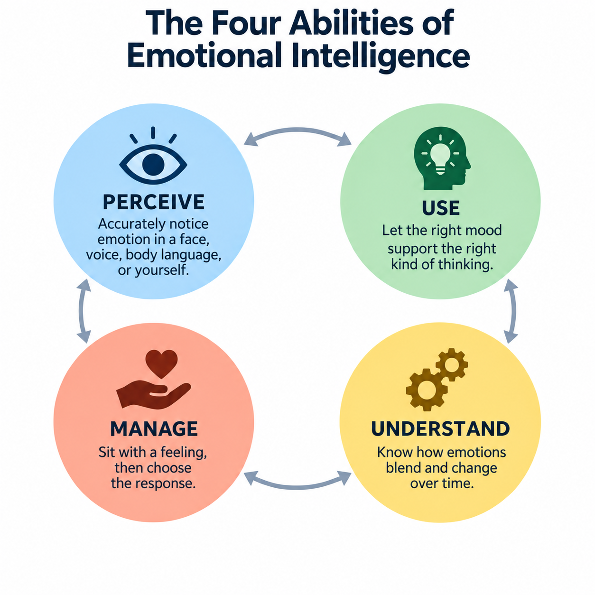
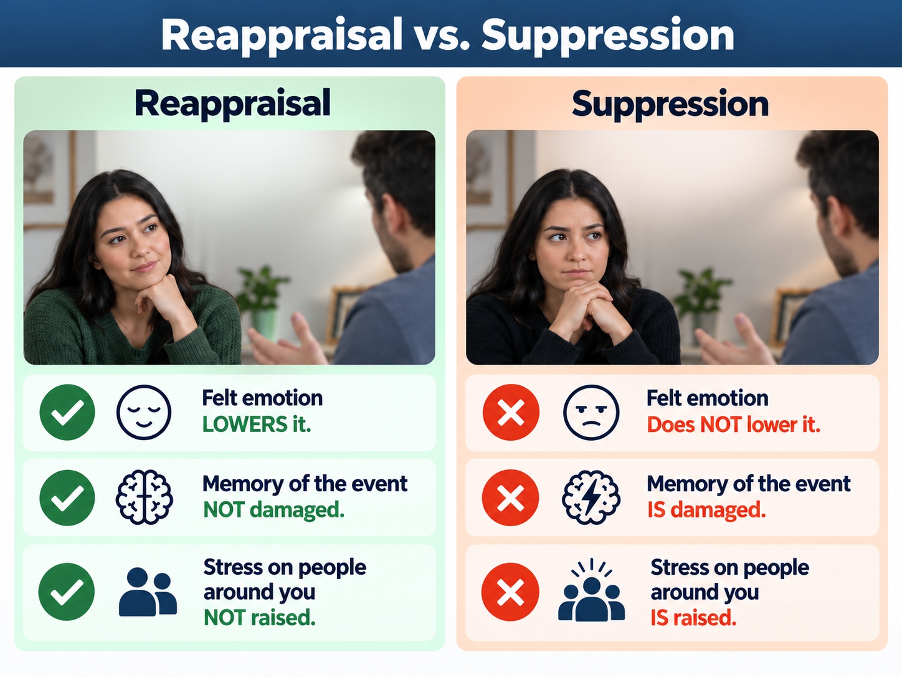

# Emotional Intelligence: The Skill Nobody Taught You

*Rebel Ranch Academy — Communication and Emotional Intelligence*

## A moment you've probably lived

Someone cuts you off in traffic, or a coworker takes credit for your idea, or your kid melts down in the grocery store. In the space of about two seconds, you're going to do one of two things: react on the raw feeling, or do something with it first. Most people never learned there's a difference — or that the difference is something you can actually get better at.

That "something" has a name: **emotional intelligence.**

## What it actually is

In 1990, psychologists Peter Salovey and John Mayer gave this idea its first real, testable definition: **the ability to monitor your own and other people's feelings, tell them apart accurately, and use that information to guide what you think and do next.** They and a colleague, David Caruso, later broke it into four specific abilities. This is the real core of the idea — plain language, no fluff:

1. **Perceive** — accurately notice emotion: in a face, a tone of voice, a slumped posture, or in yourself.
2. **Use** — let the right mood do the right job. A little seriousness helps you make a careful decision; a little excitement helps you brainstorm.
3. **Understand** — know how emotions move and change. Annoyance can turn into resentment. Nervousness can turn into excitement. Seeing that shift coming is a skill.
4. **Manage** — sit with a feeling long enough to learn something from it, then choose your next move instead of letting the feeling choose it for you.

That's it. Not a personality type. Not a magic power some people have and others don't. Four specific, practicable abilities.

## IQ vs. EQ — the comparison everyone makes but nobody explains

Almost every article about emotional intelligence tells you it's "not the same as IQ" without ever saying what IQ actually is. That's backwards — you can't judge a comparison you were only shown one side of.

**IQ (intelligence quotient)** is a standardized score meant to measure analytical reasoning: how well you solve unfamiliar problems, hold information in working memory, spot patterns, and reason with language and numbers. The modern version, introduced by psychologist David Wechsler in 1939, is a "deviation IQ" — it scores you against other people your age on a scale fixed to an average of 100. It replaced the older method (mental age ÷ actual age × 100), which broke down badly once you were an adult.

Here's the part that matters for this lesson: **IQ tests were never designed to measure how well you read a room, manage a strong feeling, or handle another person's emotions.** That's not a flaw in the test — it's just not what it's for. This is the same gap Edward Thorndike pointed out in 1920, long before "EQ" existed as a term: he noticed that the kind of smart that gets you a top score on an academic test and the kind of smart that gets you through a tense conversation are not the same skill, and called the second one *social intelligence*.

**Two people, same IQ score, different outcome:**
- A brilliant analyst who can model a spreadsheet nobody else can build, but shuts down or gets defensive the moment a teammate pushes back on it.
- A classmate with an average test score who can walk into a room where two people are about to argue and get them both talking again in under a minute.

Neither person is "smarter" in some overall sense — they're strong in *different* abilities, and most jobs and relationships need some of both. This tracks with the actual research on the topic (not just this lesson's opinion): the 2010 meta-analysis already cited below found ability-based EI predicts job performance well in high-people-contact work — teaching, nursing, customer service, management — and matters less, or can even slow you down, in fast, narrowly technical work where there isn't time for it.

**Book smart vs. people smart, in plain terms:** book smart (closer to IQ) is how fast and accurately you process information and solve a problem on paper. People smart (closer to EQ) is how accurately you read what's happening in and between people, and what you do with that in the moment. They're measured differently, they develop differently, and — this is the honest, unglamorous version — being high in one tells you very little about the other.

## Where this idea came from

This isn't a modern invention out of nowhere, and it isn't ancient wisdom either — it sits right in between. Thorndike's 1920 observation above didn't stay unanswered for long: in 1983, Howard Gardner's theory of multiple intelligences split "social intelligence" further into *interpersonal* intelligence (reading other people) and *intrapersonal* intelligence (reading yourself). Salovey and Mayer took that century of observation and finally gave it something researchers could actually test and measure.

## The part most people get wrong

Here's where this lesson does something most popular articles about "EQ" skip: it tells you what's actually still argued about.

In 1995, Daniel Goleman wrote a bestselling book that made "EQ" a household phrase — and made a bold claim that it could matter *more than IQ* for success in life. That book used a much broader definition than Salovey and Mayer's original one, mixing in things like motivation, empathy, and general social skill.

Ten years later, psychologist Edwin Locke published a pointed academic rebuttal: he argued that once you define "emotional intelligence" that broadly, it stops meaning anything specific enough to call it an intelligence at all — and that Goleman's book claimed more support from the research than the research actually showed.

So who's right? The most useful answer comes from a 2010 study that combined the results of dozens of independent studies (a meta-analysis) by Dana Joseph and Daniel Newman. Their finding is more interesting than either side's talking point: **ability-based EI predicts job performance inconsistently** — it helps in jobs that require a lot of "emotional labor" (nursing, teaching, customer service), and can even get in the way in fast, technical jobs where managing your emotions takes time you don't have. Self-reported ("mixed model") EI added some predictive value beyond IQ and personality, but not in every study.

**The honest takeaway:** emotional intelligence is a real, definable, learnable skill. Whether it deserves to be called an "intelligence," and how much it changes your life, is a legitimate scientific argument that isn't fully settled. That doesn't make the skills useless — it means you should trust the specific, evidence-backed pieces (below) more than the "EQ beats IQ, period" version that made this topic famous.

## The one technique that's actually been tested

Most advice about handling strong emotion is vague: "just calm down," "don't let it get to you." Here's a version backed by real, repeated research.

Psychologist James Gross studied two common ways people handle a strong feeling in the moment:

- **Reappraisal** — changing how you think about the situation *before* the feeling fully takes over. ("Maybe they're stressed too, not attacking me.")
- **Suppression** — feeling it fully, but bottling up the outward reaction. ("I'm furious but I'm not going to show it.")

The results aren't close. **Reappraisal** actually lowers the felt emotion, doesn't damage your memory of what happened, and doesn't raise stress in the people around you. **Suppression** does not lower the felt emotion — you still feel just as bad — while it *does* hurt your memory of the moment and *raises* physical stress in you and in whoever you're talking to.

In plain terms: bottling it up doesn't actually work, even though it feels like "handling it." Reframing how you're seeing the situation, before you react, is the one that's backed by the evidence.

## Try It — Match & Check

Two quick checks, no essay required: match each ability to what it looks like in real life, then spot the difference between reappraisal and suppression in six short scenarios.

Full activity: `activities/match-and-check.md`

## Take it further — a framework for families and classrooms

If you want a repeatable structure instead of a one-time activity, Yale's Center for Emotional Intelligence built a five-step version of this same idea, called RULER: **R**ecognize the emotion, **U**nderstand its cause, **L**abel it precisely, **E**xpress it appropriately, **R**egulate it effectively. It's been tested with thousands of students across dozens of schools, with results showing more emotionally supportive classrooms where it's used. This lesson borrows the same recognize → name → decide-what-to-do structure for its own activity, without claiming to deliver the full licensed program.

Want to go deeper on your own? `activities/name-it-to-tame-it.md` is an optional, written, one-on-one version of this same idea — pick a real moment from your own life and work through it in your own words.

## REBEL RANCH PRINCIPLE

The real principle underneath everything above is this:

> **Naming and understanding a signal before reacting to it produces a better decision than reacting on the raw signal.**

That shows up far outside "emotions":

- **Personally** — noticing "I'm actually anxious, not angry" changes what you do in the next five minutes.
- **Family** — a parent who names a meltdown ("you're frustrated, not being bad") de-escalates faster than one who only reacts to the behavior.
- **Communication and relationships** — most hard conversations go better when someone names the emotion in the room before arguing the facts.
- **Work and leadership** — the research above already shows this isn't a blanket rule: in jobs with heavy emotional demands (teaching, nursing, service), managing emotion well measurably helps performance. In some fast, technical jobs, it can even slow you down. That's the honest, non-oversold version of "EQ matters at work."
- **Money and decisions under pressure** — a panic-driven financial decision is the textbook case of reacting to the raw signal instead of naming it first.

**Where this stops being a fair comparison:** emotional intelligence is not a truth detector and it's not a substitute for actually knowing your subject. A person can read a room perfectly and still be wrong about the facts. The four abilities describe *how* you handle feelings and people — not a general life cheat code.

## What this is not

This lesson describes a psychological concept, not a treatment. If a feeling is persistent, overwhelming, or connected to something like anxiety, depression, or trauma, that calls for a qualified professional — not a worksheet.

## Before you go

Pick one specific moment coming up this week where you know a strong feeling is likely — a hard conversation, a deadline, a disagreement you've been avoiding. Decide right now: are you going to bottle it up, or reappraise it? Write down which one you picked, and check back afterward to see if the research held up for you.

---

**Sources for this lesson:** see `sources.md` for the full, linked source table. Every claim above traces to a specific, cited source — including the parts that disagree with each other.

AI-Agent: Claude (Claude Code)
Session: RRA pipeline reactivation verification, owner-directed, 2026-09-14
